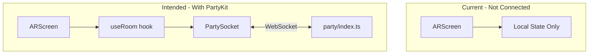

# PartyKit Deep Dive: What's Implemented vs What's Needed

## TL;DR

- **PartyKit server**: Fully implemented and ready (`party/index.ts`)
- **Leaderboard server**: Implemented (`party/leaderboard.ts`)
- **Client integration**: **Not wired up** — `useRoom` exists but is never called. AR multiplayer runs entirely locally; Create Room / Join Room do not actually connect to PartyKit.
- **Deploy**: Run `npx partykit deploy` — you'll sign in with GitHub on first run. No separate signup required.
- **To get multiplayer working**: ARScreen must call `useRoom(roomCode)` and sync state with the server.

---

## 1. Do You Need to Sign Up?

**No separate signup.** On first `npx partykit deploy`, you'll be prompted to log in via **GitHub**. That auth creates your PartyKit account. No PartyKit-specific registration page.

---

## 2. What's Already Implemented

### 2.1 Server (`party/index.ts`)

The main PartyKit server is complete:

| Message | Handler | Purpose |
|---------|---------|---------|
| `join` | `{ name, targetIndex }` | Add player to room, broadcast state |
| `ready` | — | Mark ready; when all ready → transition to `playing`, broadcast `start` |
| `jump` | — | Broadcast `playerJump` to other clients |
| `death` | `{ score }` | Mark dead, broadcast `playerDeath`; when all dead → `results` |

State: `seed`, `players`, `phase`, `startTime`. Room IDs match 4-letter codes (e.g. `ABCD`).

### 2.2 Client Hook (`src/hooks/useRoom.ts`)

`useRoom(roomId)` provides:

- `PartySocket` to `parties/main/{roomId}`
- `connected`, `roomState`, `send(msg)`, `lastEvent`
- Listens for `state` and updates `roomState`

### 2.3 Network Types (`src/types/network.ts`)

`ClientMsg` and `ServerMsg` types match the server protocol.

### 2.4 App Flow

- **Create Room**: Generates 4-letter code, sets `roomCode`, navigates to AR
- **Join Room**: User enters code, sets `roomCode`, navigates to AR
- `ARScreen` receives `roomCode` and `singlePlayerAR = !roomCode`

### 2.5 Config

- `partykit.json`: `main` + `leaderboard` parties
- `VITE_PARTYKIT_HOST`: `.env.development` = `localhost:1999`, `.env.production` = placeholder
- Scripts: `dev:party`, `deploy:party`

---

## 3. What's Missing

### 3.1 Client Never Connects

`useRoom` is not imported or used. When `roomCode` is set:

- `ARScreen` does not call `useRoom(roomCode)`
- No WebSocket connection to PartyKit
- No `join`, `ready`, `jump`, or `death` messages are sent

### 3.2 State Is Fully Local

`ARScreen` keeps:

- `slots`, `phase`, `localReady`, `countdown`, `gameSeed`, etc.

All of this is local. Players in the same room code see independent sessions; nothing is shared.

### 3.3 Flow Disconnect

Intended flow:

1. Host creates room → server room `ABCD` created on first connection
2. Guest joins `ABCD` → both connect to same room
3. Both send `join` → server builds `players`
4. Both send `ready` → server sends `start` with shared `seed` and `startTime`
5. During play: `jump` and `death` broadcast
6. When all dead → server sends `results`

Actual flow today:

1. Host creates room → only `roomCode` is set; no connection
2. Guest joins → same; no connection
3. Each client runs its own countdown and game
4. No shared seed, no shared events

---

## 4. Quick Start: Local Dev

```bash
# terminal 1 — PartyKit
npm run dev:party
# → http://localhost:1999

# terminal 2 — Vite
npm run dev
# → http://localhost:5173
```

`.env.development` already has `VITE_PARTYKIT_HOST=localhost:1999`.

---

## 5. Quick Start: Deploy

```bash
npx partykit deploy
```

1. First run: browser opens for GitHub login
2. Grant PartyKit access
3. Deploy completes
4. URL: `https://hauntline-live.<your-github-username>.partykit.dev`
5. DNS can take ~2 minutes

Then set production env:

```
VITE_PARTYKIT_HOST=hauntline-live.<your-github-username>.partykit.dev
```

Rebuild frontend so it uses this host.

---

## 6. Wiring Multiplayer: High-Level Steps

To make AR multiplayer use PartyKit:

1. **Use the room when in multiplayer**

   In `ARScreen`, when `roomCode` is set and `!singlePlayerAR`:

   ```ts
   const { connected, roomState, send } = useRoom(roomCode)
   ```

2. **Drive phase/players from server**

   When `roomState` changes, derive `phase` and `slots` from it instead of purely local state. Keep local state in sync with `roomState`.

3. **Send join on connect**

   When connected, send:

   ```ts
   send({ type: "join", name: playerName, targetIndex: slots[0].targetIndex })
   ```

   `targetIndex` comes from the marker each player is on.

4. **Sync seed and start**

   On `lastEvent.type === "start"`, use `seed` and `startTime` from the server to start the game so all clients are in sync.

5. **Send ready**

   When the user taps Ready:

   ```ts
   send({ type: "ready" })
   ```

6. **Send jump**

   In the game, when the local player jumps, call `send({ type: "jump" })`.

7. **Send death**

   When the local player dies, call `send({ type: "death", score })`.

8. **Handle remote events**

   - `playerJump`: play jump on the remote ghost
   - `playerDeath`: update remote player to dead and their score
   - `state`: refresh slots and phase from server

9. **Resolve conflicts**

   Decide when client vs server state wins (e.g. server is source of truth for `phase` and `players`; local input and animations stay on client and are broadcast via messages).

---

## 7. Architecture Overview



---

## 8. Checklist

| Item | Status |
|------|--------|
| PartyKit server (`party/index.ts`) | Done |
| Leaderboard party (`party/leaderboard.ts`) | Done |
| `useRoom` hook | Done, unused |
| Client connects when roomCode set | Not done |
| Sync phase/players from server | Not done |
| Send join/ready/jump/death | Not done |
| Handle start/jump/death from server | Not done |
| `.env.development` | Done |
| `.env.production` with real host | Needs deploy first |
| GitHub Actions deploy PartyKit | Not configured (only Pages) |
| `npx partykit deploy` manual | Ready |

---

## 9. Optional: CI/CD for PartyKit

`.github/workflows/deploy.yml` currently deploys only GitHub Pages. To auto-deploy PartyKit on push to `main`, add a step or separate job that runs `npx partykit deploy`. PartyKit docs describe this pattern.
